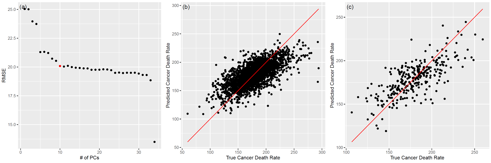
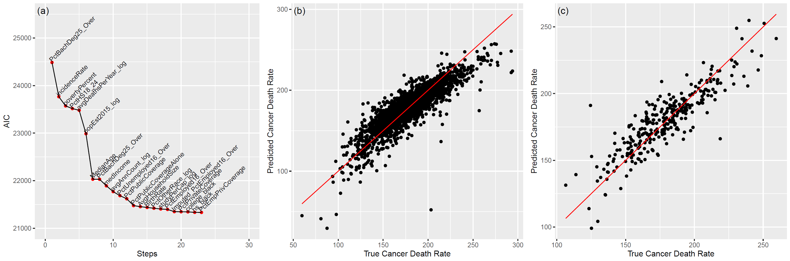

{#id .class width=80% height=80%}

# Heatmap

```{r include=FALSE}
library(tidyverse)
library(gridExtra)
library(gplots)

df <- read.csv('cancer_registry.csv')

df <- read.csv('cancer_registry.csv') %>%
  mutate(PctSomeCol18_24 = 100 - PctNoHS18_24 - PctHS18_24 - PctBachDeg18_24) %>%
  filter(incidenceRate < 1000) %>%
  filter(avgAnnCount < 20000) %>%
  filter(MedianAge < 200) %>%
  filter(AvgHouseholdSize > 1)

df <- na.omit(df)

p_values_1 <- c()
graphs1 <- list()
graph_count <- 1

vars <- colnames(df)
misc_vars <- c('binnedInc', 'Geography', 'TARGET_deathRate')
vars_1 <- setdiff(vars, misc_vars)


log_vars <- c('avgAnnCount', 'avgDeathsPerYear', 'popEst2015', 'studyPerCap', 'PctBachDeg18_24', 'PctAsian', 'PctOtherRace')
log_names <- c()


for(i in log_vars){
  temp <- paste(i, '_log', sep = '')
  
  log_names <- append(log_names, temp)
  if(i %in% c('studyPerCap')){
    df <- df %>% mutate(!!as.name(temp) := log(!!as.name(i) + 1))
  } else if(i %in% c('PctAsian', 'PctBachDeg18_24', 'PctOtherRace')){
    df <- df %>% mutate(!!as.name(temp) := log(!!as.name(i) + exp(-5)))
  } else{
    df <- df %>% mutate(!!as.name(temp) := log(!!as.name(i)))
  }
}

dep_var <- c('TARGET_deathRate')
all_vars <- setdiff(vars_1, log_vars)
all_vars <- append(all_vars, log_names)
all_vars <- sort(all_vars)

#another heatmap option

df_temp <- df %>% select(all_vars)
df_temp <- na.omit(df_temp)

heatmap2 <- cor(df_temp)

png('heatmap.png')
heatmap.2(heatmap2, trace = 'none', margins = c(10,10), col = 'cm.colors', cexRow=0.7, cexCol = 0.7)
dev.off()
```

```{r include=FALSE}
library(tidyverse)
library(gridExtra)
library(gplots)
library(glmnet)
library(grid)
library(caret)
library(olsrr)

dir = getwd()
data_dir <- paste('df_imp.RData', sep = '')
load(data_dir)

response_vars <- c('TARGET_deathRate')

df <- df_imp4 %>% select(- c('ID', 'incidenceRate'))


response_vars <- c('TARGET_deathRate')
vars <- colnames(df)
vars_1 <- setdiff(vars, response_vars)
predict_vars <- paste(vars_1, collapse = ' + ')

df <- data.frame(sapply(df, as.numeric))

set.seed(221)
test_set_index <- sample(1:nrow(df), floor(nrow(df))/10)
train_set_index <- setdiff(1:nrow(df), test_set_index)

test <- df[test_set_index,]
train <- df[train_set_index,]

test_y <- test %>% select(response_vars)
test_x <- test %>% select(vars_1)
train_y <- train %>% select(response_vars)
train_x <- train %>% select(vars_1)

lambda_seq <- 10^seq(-4, -1.95, by = .025)
set.seed(221)
cv_output <- cv.glmnet(as.matrix(train_x), as.matrix(train_y),
                       alpha = 1, lambda = lambda_seq)

best_lambda <- cv_output$lambda.min

best_lambda

lasso_best <- glmnet(as.matrix(train_x), as.matrix(train_y), alpha = 1, lambda = best_lambda)

pred_test_y <- predict(lasso_best, s = best_lambda, newx = as.matrix(test_x))
pred_train_y <- predict(lasso_best, s = best_lambda, newx = as.matrix(train_x))


cv_error <- cv_output$cvm
lambdas <- cv_output$lambda
hyper <- data.frame(lambdas, cv_error)

# taking the minimum

min_cv_error <- min(hyper$cv_error)
min_df <- hyper %>% filter(cv_error == min_cv_error)

grob <- grobTree(textGrob("(a)", x=0.01,  y=0.97, hjust=0,
  gp=gpar(fontsize=13)))


g_lasso_hyper <- ggplot() + geom_point(data = hyper, aes(x = lambdas, y = cv_error)) + 
  geom_point(data = min_df, aes(x = lambdas, y = cv_error), color = 'red') + 
  scale_x_continuous(trans = 'log10') + 
  ylab('Mean Cross-Validation Error') + 
  xlab('Lambda') + 
  ggtitle('Selection of Lambda Hyperparameter') + 
  annotation_custom(grob) + 
  theme(plot.title = element_text(hjust = 0.5))

train_results <- data.frame(train_y, pred_train_y)
colnames(train_results) <- c('y_true', 'y_hat')
R_squared <- as.numeric(unname(cor(train_y, pred_train_y)))
r_squared_lasso_train <- R_squared
R_squared <- sprintf("%.3f", round(R_squared,3))
R_squared_label <- paste('R^2 = ', R_squared)
rmse_lasso_train <- sqrt(sum((train_results$y_true - train_results$y_hat)^2)/nrow(train_results))

grob <- grobTree(textGrob("(b)", x=0.01,  y=0.97, hjust=0,
  gp=gpar(fontsize=13)))

g_lasso_train <- ggplot(train_results) + 
  geom_point(aes(x = y_true, y= y_hat)) + 
  geom_line(aes(x = y_true, y = y_true), color = 'red')  +
  geom_label(label = R_squared_label, x = 100, y = 275, label.padding = unit(0.55, "lines"),
    label.size = 0.35,
    color = "black",
    fill="#69b3a2") + 
  ylab('Predicted Cancer Death Rate') + 
  xlab('True Cancer Death Rate') + 
  ggtitle('Lasso Train Prediction') + 
  annotation_custom(grob) + 
  theme(plot.title = element_text(hjust = 0.5))

test_results <- data.frame(test_y, pred_test_y)
colnames(test_results) <- c('y_true', 'y_hat')
R_squared <- as.numeric(unname(cor(test_y, pred_test_y)))
r_squared_lasso_test <- R_squared
R_squared <- sprintf("%.3f", round(R_squared,3))
R_squared_label <- paste('R^2 = ', R_squared)
rmse_lasso_test <- sqrt(sum((test_results$y_true - test_results$y_hat)^2)/nrow(test_results))

grob <- grobTree(textGrob("(c)", x=0.01,  y=0.97, hjust=0,
  gp=gpar(fontsize=13)))

g_lasso_test <- ggplot(test_results) + 
  geom_point(aes(x = y_true, y= y_hat)) + 
  geom_line(aes(x = y_true, y = y_true), color = 'red')  +
  geom_label(label = R_squared_label, x = 125, y = 250, label.padding = unit(0.55, "lines"),
    label.size = 0.35,
    color = "black",
    fill="#69b3a2") + 
  ylab('Predicted Cancer Death Rate') + 
  xlab('True Cancer Death Rate') + 
  ggtitle('Lasso Test Prediction') + 
  annotation_custom(grob) + 
  theme(plot.title = element_text(hjust = 0.5))  


lasso_beta_hat <- as.numeric(lasso_best$beta)
lasso_var_names <- rownames(lasso_best$beta)

lasso_final_df <- data.frame(lasso_coeffs = lasso_beta_hat)
rownames(lasso_final_df) = lasso_var_names

# PCA PART -----------------------------------------------------

dir = getwd()
data_dir <- paste('df_imp.RData', sep = '')
load(data_dir)

response_vars <- c('TARGET_deathRate')
y <- df_imp4 %>% select(response_vars)
y <- unname(unlist(y))


do_not_include <- c('ID', 'TARGET_deathRate', 'incidenceRate', 'popEst2015_log', 'medIncome', 'avgAnnCount_log')
do_not_include <- c('ID', 'TARGET_deathRate')

df <- df_imp4 %>% select(- do_not_include)


vars_1 <- colnames(df)
df <- data.frame(sapply(df, as.numeric))

S <- cov(df)
eig <- eigen(S)
eig_vals <- eig$values
eig_vecs <- eig$vectors

cum_var_explained <- cumsum(eig_vals/(sum(eig_vals)))


PCA_model <- prcomp(df)
PCA_loadings <- PCA_model$rotation

PCA_summary <- summary(PCA_model)


set.seed(221)
test_set_index <- sample(1:nrow(df), floor(nrow(df))/10)
train_set_index <- setdiff(1:nrow(df), test_set_index)

test <- df[test_set_index,]
train <- df[train_set_index,]

test_y <- y[test_set_index]
test_x <- test %>% select(vars_1)
train_y <- y[train_set_index]
train_x <- train %>% select(vars_1)


num_comp <- 1:ncol(train_x)
mses <- integer(ncol(train_x))
results <- data.frame()

PCA_train_model <- prcomp(train_x)
component_matrix <- data.frame(as.matrix(train_x) %*% PCA_train_model$rotation)

for(i in num_comp){
  
  pca_df <- data.frame(component_matrix[,1:i])
  
  
  eq <- paste(colnames(pca_df), collapse = ' + ')
  eq <- paste('deathRate', eq, sep = ' ~ ')
  
  pca_df <- pca_df %>% mutate(deathRate = train_y)
  
  # Train the model
  
  train.control <- trainControl(method = "cv", number = 10)
  
  model <- train(deathRate ~., data = pca_df, method = "lm",
               trControl = train.control)
  if(i == 1){
    results <- model$results
  } else{
    results <- rbind(results, model$results)
  }

}

results <- results %>% mutate(ID = as.numeric(rownames(results)))
results_best <- results %>% filter(ID == 10)

grob <- grobTree(textGrob("(a)", x=0.01,  y=0.97, hjust=0,
  gp=gpar(fontsize=13)))

g_pca_hyper <- ggplot() + geom_point(data = results, aes(x = ID, y = RMSE)) + 
  geom_point(data = results_best, aes(x = ID, y= RMSE), color = 'red') + 
  xlab('# of PCs') + 
  ylab('RMSE') + 
  ggtitle('Selecting Number of Principal Components') + 
  annotation_custom(grob) + 
  theme(plot.title = element_text(hjust = 0.5))   


n <- 10

train_component_matrix <- data.frame(as.matrix(train_x) %*% PCA_train_model$rotation)
pca_df <- data.frame(train_component_matrix[,1:n])

eq <- paste(colnames(pca_df), collapse = ' + ')
eq <- paste('deathRate', eq, sep = ' ~ ')

pca_df <- pca_df %>% mutate(deathRate = train_y)

pca_train_model_2 <- lm(eq, data = pca_df)
RMSE_PCA_train <- sqrt(sum(residuals(pca_train_model_2)^2)/nrow(pca_df))

y_pred <- pca_train_model_2$fitted.values

pca_df <- pca_df %>% mutate(y_pred = y_pred)

R_squared <- as.numeric(unname(cor(y_pred, train_y)))
R_squared_PCA_train <- R_squared
R_squared <- sprintf("%.3f", round(R_squared,3))
R_squared_label <- paste('R^2 = ', R_squared)


grob <- grobTree(textGrob("(b)", x=0.01,  y=0.97, hjust=0,
  gp=gpar(fontsize=13)))

g_pca_train <- ggplot(data = pca_df) + 
  geom_point(aes(x = deathRate, y = y_pred)) + 
  geom_line(aes(x = deathRate, y = deathRate), color = 'red') + 
  geom_label(label = R_squared_label, x = 100, y = 275, label.padding = unit(0.55, "lines"), 
             label.size = 0.35,
             color = "black",
             fill="#69b3a2") + 
  xlab('True Cancer Death Rate') + 
  ylab('Predicted Cancer Death Rate') + 
  ggtitle('PCA Train Prediction') + 
  annotation_custom(grob) + 
  theme(plot.title = element_text(hjust = 0.5)) 


n <- 10

# use the train_PCA_loadings

test_component_matrix <- data.frame(as.matrix(test_x) %*% PCA_train_model$rotation)
pca_df <- data.frame(test_component_matrix[,1:n])

eq <- paste(colnames(pca_df), collapse = ' + ')
eq <- paste('deathRate', eq, sep = ' ~ ')


### Do we fit the test set data and get beta_test_hat??

# pca_test_model <- lm(eq, data = pca_df)
# RMSE_PCA_test <- sqrt(sum(residuals(pca_test_model)^2)/nrow(pca_df))
# 
# y_pred <- unname(predict(pca_test_model))

y_pred <- predict(pca_train_model_2, test_component_matrix)
RMSE_PCA_test <- sqrt(sum((y_pred - test_y)^2)/nrow(pca_df))

pca_df <- pca_df %>% mutate(y_pred = y_pred)
pca_df <- pca_df %>% mutate(deathRate = test_y)

R_squared <- as.numeric(unname(cor(y_pred, test_y)))
R_squared_PCA_test <- R_squared
R_squared <- sprintf("%.3f", round(R_squared,3))
R_squared_label <- paste('R^2 = ', R_squared)

grob <- grobTree(textGrob("(c)", x=0.01,  y=0.97, hjust=0,
  gp=gpar(fontsize=13)))

g_pca_test <- ggplot(data = pca_df) + 
  geom_point(aes(x = deathRate, y = y_pred)) + 
  geom_line(aes(x = deathRate, y = deathRate), color = 'red') + 
  geom_label(label = R_squared_label, x = 125, y = 250, label.padding = unit(0.55, "lines"), 
             label.size = 0.35,
             color = "black",
             fill="#69b3a2") + 
  xlab('True Cancer Death Rate') + 
  ylab('Predicted Cancer Death Rate') + 
  ggtitle('PCA Test Prediction') + 
  annotation_custom(grob) + 
  theme(plot.title = element_text(hjust = 0.5)) 


s_PCA <- summary(pca_train_model_2)
loadings <- PCA_train_model$rotation
final_loadings <- loadings[,1:10]

# STEPWISE ---------------------------------------------------------

dir = getwd()
data_dir <- paste('df_imp.RData', sep = '')
load(data_dir)


df <- df_imp4 %>% select(- c('ID'))
response_vars <- c('TARGET_deathRate')
vars <- colnames(df)
vars_1 <- setdiff(vars, response_vars)
predict_vars <- paste(vars_1, collapse = ' + ')

df <- data.frame(sapply(df, as.numeric))


set.seed(221)
test_set_index <- sample(1:nrow(df), floor(nrow(df))/10)
train_set_index <- setdiff(1:nrow(df), test_set_index)

test <- df[test_set_index,]
train <- df[train_set_index,]

test_y <- test %>% select(response_vars)
test_y <- unlist(unname(test_y))
test_x <- test %>% select(vars_1)
train_y <- train %>% select(response_vars)
train_y <- unlist(unname(train_y))
train_x <- train %>% select(vars_1)


step_model <- step(lm(TARGET_deathRate ~ 1, data = train), ~ incidenceRate + medIncome + povertyPercent + MedianAge + AvgHouseholdSize + PercentMarried + PctNoHS18_24 + PctHS18_24 + PctSomeCol18_24 + PctHS25_Over + PctBachDeg25_Over + PctEmployed16_Over + PctUnemployed16_Over + PctPrivateCoverage + PctPrivateCoverageAlone + PctEmpPrivCoverage + PctPublicCoverage + PctPublicCoverageAlone + PctWhite + PctBlack + PctMarriedHouseholds + BirthRate + Imputed_PctEmployed16_Over + Imputed_PctPrivateCoverageAlone + avgAnnCount_log + avgDeathsPerYear_log + popEst2015_log + studyPerCap_log + PctBachDeg18_24_log + PctAsian_log + PctOtherRace_log + hs_black + hs_white + college_black, direction="both")


features <- 'PctBachDeg25_Over + incidenceRate + povertyPercent + PctHS18_24 + avgDeathsPerYear_log + popEst2015_log + MedianAge + medIncome + avgAnnCount_log + PctUnemployed16_Over + PctPublicCoverage + PctPublicCoverageAlone + BirthRate + AvgHouseholdSize + PctOtherRace_log + studyPerCap_log + PctEmployed16_Over + Imputed_PctEmployed16_Over + PctPrivateCoverage + college_black + PctBlack + PctNoHS18_24 + PctEmpPrivCoverage'
features2 <- unlist(strsplit(features, split = ' + ', fixed = T))


train_x <- train_x %>% select(features2)

pred_train_y <- predict(step_model, data = train_x)

RMSE_step_train <- sqrt(sum((pred_train_y - train_y)^2)/length(train_y))

train_results <- data.frame(train_y, pred_train_y)
colnames(train_results) <- c('y_true', 'y_hat')
R_squared <- as.numeric(unname(cor(train_y, pred_train_y)))
R_squared_step_train <- R_squared
R_squared <- sprintf("%.3f", round(R_squared,3))
R_squared_label <- paste('R^2 = ', R_squared)

grob <- grobTree(textGrob("(b)", x=0.01,  y=0.97, hjust=0,
  gp=gpar(fontsize=13)))

g_step_train <- ggplot(train_results) + 
  geom_point(aes(x = y_true, y= y_hat)) + 
  geom_line(aes(x = y_true, y = y_true), color = 'red')  +
  geom_label(label = R_squared_label, x = 100, y = 275, label.padding = unit(0.55, "lines"),
    label.size = 0.35,
    color = "black",
    fill="#69b3a2") + 
  ylab('Predicted Cancer Death Rate') + 
  xlab('True Cancer Death Rate') + 
  ggtitle('Stepwise Selection Train Prediction') + 
  annotation_custom(grob) + 
  theme(plot.title = element_text(hjust = 0.5)) 


test_x <- test_x %>% select(features2)
pred_test_y <- unname(predict(step_model, test_x))

RMSE_step_test <- sqrt(sum((pred_test_y - test_y)^2)/length(test_y))

test_results <- data.frame(test_y, pred_test_y)
colnames(test_results) <- c('y_true', 'y_hat')
R_squared <- as.numeric(unname(cor(test_y, pred_test_y)))
R_squared_step_test <- R_squared
R_squared <- sprintf("%.3f", round(R_squared,3))
R_squared_label <- paste('R^2 = ', R_squared)

grob <- grobTree(textGrob("(c)", x=0.01,  y=0.97, hjust=0,
  gp=gpar(fontsize=13)))

g_step_test <- ggplot(test_results) + 
  geom_point(aes(x = y_true, y= y_hat)) + 
  geom_line(aes(x = y_true, y = y_true), color = 'red')  +
  geom_label(label = R_squared_label, x = 125, y = 250, label.padding = unit(0.55, "lines"),
    label.size = 0.35,
    color = "black",
    fill="#69b3a2") + 
  ylab('Predicted Cancer Death Rate') + 
  xlab('True Cancer Death Rate') + 
  ggtitle('Stepwise Selection Test Prediction') + 
  annotation_custom(grob) + 
  theme(plot.title = element_text(hjust = 0.5))   


step_coeffs <- step_model$coefficients
df_step_coeffs <- data.frame(step_coeffs)


model <- lm(TARGET_deathRate ~ ., data = train)
k <- ols_step_both_aic(model)

df_AIC <- data.frame(steps = 1:k$steps, AIC = k$aic, vars = k$predictors)


grob <- grobTree(textGrob("(a)", x=0.01,  y=0.97, hjust=0,
  gp=gpar(fontsize=13)))

g_step_hyper <- ggplot(df_AIC, aes(x= steps, y= AIC, label=vars))+
  geom_point(color = 'red') + 
  geom_line() + 
  geom_text(aes(label=vars),hjust=0, vjust=0, angle = 45, size = 3) + 
  xlim(0,30) + 
  ylim(21000, 25500) + 
  xlab('Steps') + 
  ylab('AIC') + 
  ggtitle('Forward and Backward Stepwise Model') + 
  annotation_custom(grob) + 
  theme(plot.title = element_text(hjust = 0.5))   

# PUTTING IT ALL TOEGHER ---------------------------------------------------


final_coeffs <- merge(df_step_coeffs, lasso_final_df, by = "row.names", all = TRUE)
rownames(final_coeffs) <- final_coeffs$Row.names
final_coeffs <- final_coeffs %>% select(-c(Row.names))

#the loadings for the PCA
#final_loadings

#the betas for the 10 PC's
#summary(pca_train_model_2)


R_squared_train <- c(r_squared_lasso_train, R_squared_PCA_train, R_squared_step_train)
R_squared_test <- c(r_squared_lasso_test, R_squared_PCA_test, R_squared_step_test)
RMSE_train <- c(rmse_lasso_train, RMSE_PCA_train, RMSE_step_train)
RMSE_test <- c(rmse_lasso_test, RMSE_PCA_test, RMSE_step_test)

final_metrics <- rbind(R_squared_train, R_squared_test, RMSE_train, RMSE_test)
colnames(final_metrics) <- c('Lasso', 'PCA', 'Stepwise')

train_metrics <- rbind(R_squared_train, RMSE_train)
colnames(train_metrics) <- c('Lasso', 'PCA', 'Stepwise')

test_metrics <- rbind(R_squared_test, RMSE_test)
colnames(test_metrics) <- c('Lasso', 'PCA', 'Stepwise')


lay <- rbind(c(1,2,3),
             c(4,5,6),
             c(7,8,9))

lay1 <- rbind(c(1,2,3))
```

# Display these

```{r}
train_metrics
```

```{r}
test_metrics
```

```{r}
final_coeffs
```

```{r}
grid.arrange(g_lasso_hyper,g_lasso_train,g_lasso_test, layout_matrix = lay1)
```

```{r}
grid.arrange(g_pca_hyper,g_pca_train,g_pca_test, layout_matrix = lay1)
```

```{r}
grid.arrange(g_step_hyper,g_step_train,g_step_test, layout_matrix = lay1)
```
