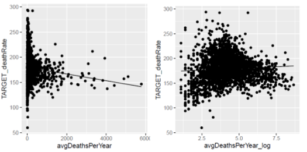
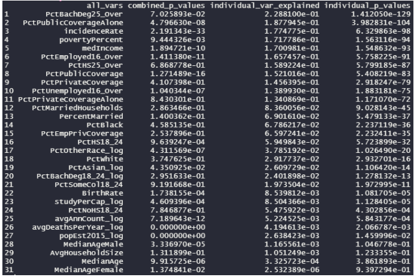

```{r, message = F, warning = F, echo = F }
library(tidyverse)
cancer = read_csv("cancer_registry.csv") %>% 
  # Split the geography variable
  separate(Geography, into = c("county", "state"), sep = ", ") %>% 
  # Split up binnedInc into a lower and upper decile
  mutate(
    binnedInc = str_remove_all(binnedInc, "[(\\]]"),
    # also try to group states by region
    region = case_when(
      state %in% c("California", "Oregon", "Washington", "Nevada", "Idaho", 
                   "Montana", "Wyoming", "Colorado", "Utah", "Alaska", "Hawaii") ~ "West",
      state %in% c("Arizona", "New Mexico", "Texas", "Oklahoma") ~ "Southwest",
      state %in% c("North Dakota", "South Dakota", "Nebraska", "Kansas", 
                   "Minnesota", "Iowa", "Missouri", "Wisconsin", "Illinois", 
                   "Indiana", "Ohio", "Michigan") ~ "Midwest",
      state %in% c("Arkansas", "Louisiana", "Mississippi", "Alabama", "Georgia",
                   "Florida", "South Carolina", "North Carolina", "Tennessee",
                   "Kentucky", "Virginia", "West Virginia", "District of Columbia",
                   "Delaware") ~ "Southeast",
      state %in% c("Maryland", "Pennsylvania", "New Jersey", "New York", "Rhode Island",
                   "Connecticut", "Massachusetts", "New Hampshire", "Vermont", "Maine") ~ "Northeast",
      TRUE ~ "Southwest" # Weird formatting means a single NM is NA in state
    )
  ) %>% 
  separate(binnedInc, into = c("inc_dec_low", "inc_dec_high"), sep = ",") %>% 
  janitor::clean_names() # Convert all column names to lowercase
```

# Introduction


# Exploratory Data Analysis

Our data is an aggregation of multiple sources including the American Community Survey, the Census, clinical trials and from cancer databases. The observational unit is a state county, and each observation contains various demographic, economic and educational factors. Our outcome is **cancer mortality rate**, measured as number of deaths per capita (100K people).

The data contains information on `r nrow(cancer)` counties in the United States. The data is not fully descriptive of all counties in the US because `r 3141 - nrow(cancer)` are missing. We surmise these counties are missing due to lack of data for them. 

The average mortality per capita is `r cancer %>% pull(target_death_rate) %>% mean %>% round(., 2)` across the dataset. Cancer mortality has a nice bell shape, but there are a few outliers present (Figure 1)

We explored how other variables in the dataset correlated with the cancer mortality in the counties. The data also includes information on the incidence of cancer in each county, so we checked how it related to mortality. As expected, higher incidence correlates highly with higher mortality, so this should be accounted for in a model. There was no apparent trend between cancer mortality per capita and either age or education level. 

We discovered some trends in the socioeconomic and demographic data. We found a relationship between insurance type and cancer mortality. Counties where a higher proportion of the population has a private insurance had lower cancer mortality. This trend was reversed for counties with a high proportion of public insurance. Race also seemed to have a relationship with cancer mortality (Figure 2). Counties with a higher proportion of African-Americans experienced higher rates of mortality, and the reverse trend was observed in white Americans. No obvious trend was seen in Asian-Americans or races defined as "other". In terms of education, higher rates of college education in a county was negatively correlated with mortality, and this was the only negative correlation seen in any of the education groups (no high school, high school graduate, bachelors).

It is commonly believed that higher education unlocks access to greater ecomonic opportunities later in life. We believe that there could be an interesting interaction between education and race that can be discerned from our data. 

# Questions Of Interest

Our exploratory data analyses lead us to two specific research questions:

1. Is there a significant interaction between any demographic and economic factors that contributes to increased cancer mortality in a county?
2. Can we use any significant findings from (1) that can help predict future cancer mortality in the counties?

Knowing that any interaction between education and race could possibly be beneficial to improving a subseqeunt prediciton model.

# Initial Analyses

For our inference model, we plan to look at race proportions and education level proportions as the main effects in our model and include their interactions, our coefficients of interest. We also plan to include important confounders such as county size, cancer incidence, age, insurance type and sex to help adjust for these factors between counties.

We needed to perform some transformations on the data since some covariates such as average death rate had values that skewed extremely low or high (Figure 3). For these covariates with exterme values, we log-transformed them to give them a more even distribution. To help guide model selection later,we calculated the p-value and percent variance explained for each covariate (Figure 4). The percent variance explained was highest for percent of residents over 25 with a bachelor’s degree (`PctBachDeg25_Over`) at 0.223 along with a p-value of 1.41e-129.

As an initial prediction model, we fit all 31 covariates individually with cancer death rate as the response. The resulting adjusted $R^2$ was 0.7664. We took note of the p-value for each covariate in this joint model, some of which significantly differedd from the p-value obtained when modeled alone (Figure 4). This likely happens because a few covariates are correlated with each other and explain similar underlying trends in the cancer rate. To gain a better understanding of collinearity of the covariates, we also plotted a heatmap of the pairwise correlations (Figure 5). This confirmed our initial belief about the redundancy in the data, so we can trim out redundant covariates from our model.

One approach we explored was principal component analysis (PCA) on all 31 covariates. We found that the first principal component explains nearly all the variance in the dataset.

# Future Directions

For our inference model, we plan to use the Wald Test to test the joint hypothesis that all the interaction coefficients are zero. We may also use bootstrap to understand these coefficients better.

For our prediction model, we plan to explore model selection from multiple angles, such as PCA, regularization, or hand-picking non-correlated covariates that individually explain the response variable well. For the first two approaches, we will use cross-validation to pick an optimal hyperparameter (shrinkage factor or number of principal components respectively) to tune the linear model in preparation for cross-validation so we do not overfit the data. Different error metrics such as absolute error or squared error may also be explored. We intend to use an 80-10-10 split of the data between training, cross-validation and testing.

\pagebreak

# Figures

```{r, echo = F, out.width = "70%", fig.align = 'center' }
cancer %>% 
  ggplot(aes(x = target_death_rate)) +
  geom_histogram(color = "black", fill = "white", bins = 30) +
  geom_vline(xintercept =  cancer %>% pull(target_death_rate) %>% mean, color = "red") + 
  labs(
    title = "Empirical distribution of cancer mortality in the data",
    x = "Cancer Morality (deaths / 100K)",
    y = "Frequency",
    caption = "Figure 1") +
  theme_minimal() +
  theme(plot.title = element_text(hjust = 0.5))
```


```{r,  echo = F, out.width = "70%", fig.align = 'center', message = F }
cancer %>% 
  pivot_longer(
    cols = c("pct_white", 
             "pct_black", 
             "pct_asian",
             "pct_other_race"),
    values_to = "pct",
    names_to = "race"
  ) %>% 
  ggplot(aes(x = pct, y = target_death_rate, color = race)) + 
  facet_grid(race ~ .) +
  geom_point(size = 0.5, alpha = 0.1) +
  geom_smooth(method = "lm") +
  theme_minimal() +
  theme(legend.position = "bottom",
        plot.title = element_text(hjust = 0.5),
        strip.text.y = element_blank()) +
  labs(
    title = "Cancer mortality by percentage of race in each county",
    x = "Percentage of race (%)",
    y = "Cancer Morality (deaths / 100K)",
    caption = "Figure 2") +
  scale_color_discrete(labels = c("Asian", "Black", "Other", "White"))
```


Figure 3: Log-transformation of deaths per year covariate to achieve better data spread.


Figure 4: Metrics to evaluate predictive power for each covariate, including p-value and percent variance explained.


Figure 5: Heatmap of the pairwise correlation of all 31 covariates.